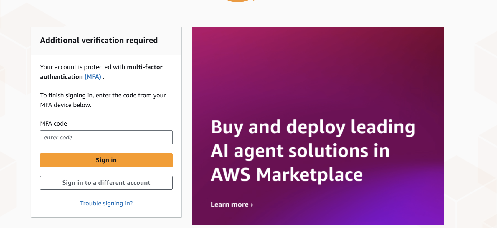
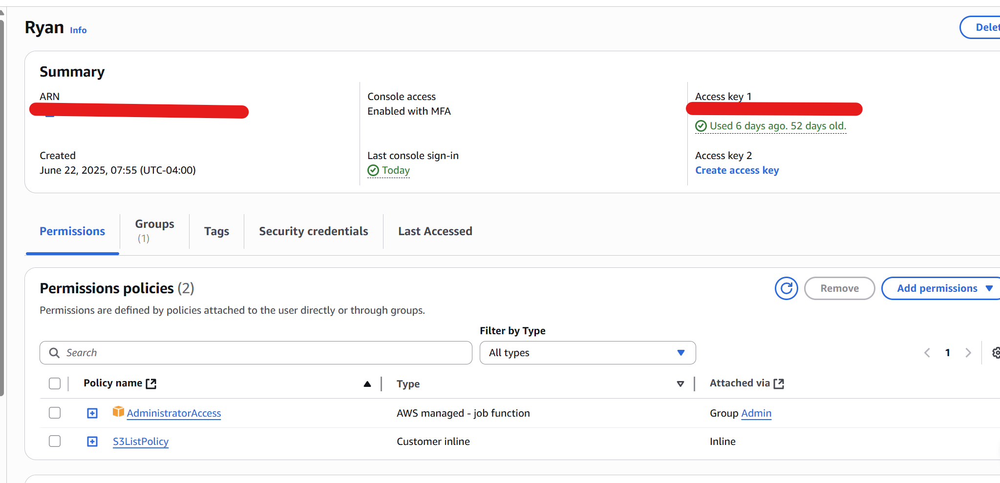
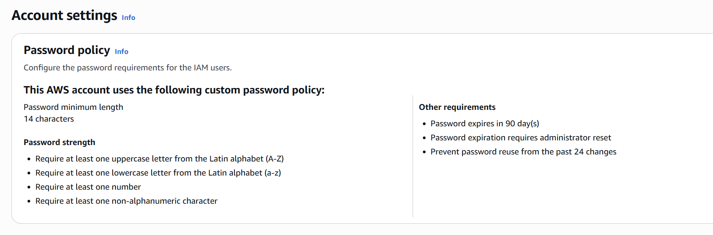

# IAM Lab - Learning best practices

Showing complete and full steps and things I am learning alot the way,
for a full documentated journey 

---

## Table Of Contents

- [Lesson 1: Setting up Root user and Admin user](#lesson-1-setting-up-root-user-and-admin-user)
- [Lesson 2: Groups, Users, Profiles for least priveleged access](#lesson-2-groups-users-profiles-for-least-priveleged-access)
- [Lesson 3: Learning the theory behind IAM](#lesson-3-learning-the-theory-behind-iam)
- [Full CLI Command reference for IAM](#full-cli-command-referenece-for-iam)


---

## Lesson 1: Setting up Root user and Admin user
1. Created non-root user and enabled MFA for best security practices.
2. Created IAM admin user and user group with admin priveleges
3. Created a Secure Password Policy 
4. Learned about organized by Lab vs through Production and why that is important 

### CLI commands used 
2. Creating an IAM admin user and group usin the CLI
```bash
## Creating admin Group and attaching policy 
aws iam create-group --group-name AdminGroup

aws iam attach-group-policy \
  --group-name AdminGroup \
  --policy-arn arn:aws:iam::aws:policy/AdministratorAccess

## Creating admin user, login profile, and adding user to a group 
aws iam create-user --user-name AdminUser

aws iam create-login-profile --user-name AdminUser --password '******' --password-reset-required

aws iam add-user-to-group --user-name AdminUser --group-name AdminGroup
```
3. Used CLI commands to create a secure password policy
```bash 
## Best practice
aws iam update-account-password-policy \
  --minimum-password-length 14 \
  --require-symbols \
  --require-numbers \
  --require-uppercase-characters \
  --require-lowercase-characters \
  --max-password-age 90 \
  --password-reuse-prevention 24 \
  --hard-expiry

## for my lab enviornment 
aws iam update-account-password-policy \
  --minimum-password-length 8 \
  --require-symbols \
  --require-numbers \
  --require-uppercase-characters \
  --require-lowercase-characters 
```

### Proof of Work:
1. Created non-root user and enabled MFA for best security practices.

2. Created IAM admin user and user group with admin priveleges
 
3.  Created a Secure Password Policy 


### Notes

4. **Learning Production vs Lab Enviorments**

Lab Account:
- Safe space to experiment.
- Has budget alarms so we don’t overspend.
- Good for testing IAM policies, CLI commands, CloudFormation templates, etc.
- All practice projects go here.

Prod Account:
- Mistakes here mean outaes, security risks and money lost
- Stricter permissions on profiles
- Used only when we are sure the code is tested

Best way to seperate lab vs prod is with different AWS accounts

Different profiles are used for developer and read-only access

### Wrap up 
In this first lesson, I learned how to properly secure the AWS account creating a admin user and making sure not to touch the root user. I created a non-root IAM admin user and enabled MFA on both the root and admin accounts to follow best security practices. I then set up an IAM admin group with administrator privileges and added my new admin user to it. 

I implemented a secure password policy that enforces strong length and complexity requirements. 

I then learned the importance of separating a Lab environment from Production through profiles and tagging, so that experiments never risk impacting production resources.

---


## Lesson 2: Groups, Users, Profiles for least priveleged access

**Overview** 
In this lesson I will be going over how users should be created and used in a real world worl enviorment. 
The goal of IAM is to have users have the least amount of access to make things more secure.
I am make 3 users and groups to simualate that. 

- Created admin, develeoper, readonly users and groups and attached policies and assigned them to their respective groups.
- Created access keys for each user
- Configured the profiles
- Verified profiles
- Default to readonly for safer day-to-day operation to simulate a real world work environment


### Proof of Work:

```bash
# Create groups
aws iam create-group --group-name Admin
aws iam create-group --group-name Developer
aws iam create-group --group-name ReadOnly

# Attach managed policies
aws iam attach-group-policy --group-name Admin     --policy-arn arn:aws:iam::aws:policy/AdministratorAccess
aws iam attach-group-policy --group-name Developer --policy-arn arn:aws:iam::aws:policy/PowerUserAccess
aws iam attach-group-policy --group-name ReadOnly  --policy-arn arn:aws:iam::aws:policy/ReadOnlyAccess

# Users
aws iam create-user --user-name admin-user
aws iam create-user --user-name dev-user
aws iam create-user --user-name readonly-user

# Add to groups
aws iam add-user-to-group --user-name admin-user     --group-name Admin
aws iam add-user-to-group --user-name dev-user       --group-name Developer
aws iam add-user-to-group --user-name readonly-user  --group-name ReadOnly

# Create access keys
aws iam create-access-key --user-name admin-user
aws iam create-access-key --user-name dev-user
aws iam create-access-key --user-name readonly-user

# Configured profiles
aws configure --profile admin
aws configure --profile developer
aws configure --profile readonly

# Verified profiles
aws sts get-caller-identity --profile admin
aws sts get-caller-identity --profile developer
aws sts get-caller-identity --profile readonly

# Default to readonly
export AWS_PROFILE=readonly 

```

### Notes:

This is an important lesson, I have setup my account to enforce least privelege access. 

I created groups, users, and profiles. 

Admin - with full control
Developer - with alot of permissions but not IAM
Read-Only - for view only access

I learned aboout profiles and storing the credentials for each to be able to run commands direclty under a chosen profile.

I learned about make read-only the default profile to safely view things and only switch to a user with more access if needed. 

Later down the line I will introduce more security by making the Admin profile keyless and accessed via roles with MFA. 
Developer will get mroe scoped down policies and I will touch on that later as well when I make my own custom policies.
Later I will also make sure to manage the credentials using a tool like aws-vault. 


## Lesson 3: Learning the theory behind IAM

**Overview** 

This lesson is less CLI focused and more about learning the principles of IAM and also have a good refernce guide to come back too when needed:

- [Basics of IAM - Users, Groups, Roles, Policies](#basics-of-iam---users-groups-roles-policies)
- [AWS-managed vs. Customer-managed policies](#aws-managed-vs-customer-managed-policies)
- [Inline vs. Attached Policies](#inline-vs-attached-policies)

### Basics of IAM - Users, Groups, Roles, Policies
In AWS, IAM is built on four main building blocks: users, groups, roles, and policies. A user represents an individual person or application that interacts with AWS and typically has long-term credentials such as a username and password for the console or an access key and secret key for programmatic access. While users can exist independently, they are often placed into groups, which serve only to organize users and make permission management easier. Groups cannot log in or hold credentials, but any user added to a group inherits the policies attached to that group.

A role is another type of identity, but unlike users it does not have permanent credentials. Instead, roles are assumed temporarily by AWS services (such as EC2 or Lambda), by users, or even by other accounts in a cross-account setup. When a role is assumed, AWS provides temporary credentials through the Security Token Service (STS). This design makes roles much safer than long-term access keys and is the recommended way to grant services or external accounts access to resources.

The real power of IAM comes from policies, which are JSON documents that define exactly what an identity can or cannot do. Each policy statement includes an effect (allow or deny), a list of actions (such as s3:GetObject), the resources those actions apply to (like a specific S3 bucket ARN), and optional conditions that further restrict when or how permissions can be used. By default, AWS denies all actions, so an explicit allow is required to grant access. Inline policies can be attached directly to a single identity, but in practice, permissions are most often managed by attaching reusable managed policies to groups or roles.

All of these elements work together: a user might log in and inherit permissions from a group, or they may assume a role to temporarily gain different permissions. Services like EC2 or Lambda also use roles to securely interact with other AWS resources without needing hardcoded keys. In practice, best security comes from relying on roles rather than permanent user keys, assigning permissions to groups instead of individual users, and following the principle of least privilege when writing policies. Regular auditing with tools like IAM credential reports and Access Analyzer ensures that these identities and permissions stay secure over time.

- **Users** - individual identities with long-term credentials (passwords, keys).
- **Groups** - collections of users, used only for managing permissions. No credentials.
- **Roles** - identities with temporary credentials, assumed by users, services, or accounts. Best practice for services (EC2, Lambda).
- **Policies** - JSON docs defining permissions (Effect, Action, Resource, Condition). Deny by default.
- **Best practice**:
    - Use roles over static access keys.
    - Assign permissions to groups, not directly to users.
    - Follow least privilege (grant only what’s needed).
    - Audit regularly with Credential Reports + Access Analyzer.

### AWS-managed vs. Customer-managed policies
IAM permissions are defined by policies, and these come in two main types: AWS-managed and customer-managed. AWS-managed policies are created and maintained by AWS. They cover common use cases like read-only access to S3 or full access to EC2 and are automatically updated when AWS changes or adds services. These policies are convenient because they save time and reduce the chance of errors when setting up basic access. However, they are usually broader than what’s needed and don’t always follow least-privilege principles, since they’re meant to apply to a wide audience.

On the other hand, customer-managed policies are created and maintained by you within your AWS account. These are custom-tailored to your environment and can be as specific as you need them to be, such as granting read/write access only to a single bucket or restricting EC2 actions to a particular region. They provide much finer control and are the recommended option for production workloads. The tradeoff is that you must design, test, and update these policies yourself as your environment evolves.

In practice, AWS-managed policies are great for learning, experimentation, or quick setups, but once you move into serious or sensitive environments, customer-managed policies become essential. Following least privilege almost always requires writing and maintaining your own policies, even if you start from an AWS-managed one as a template.

- **AWS-managed policies**:
    - Created/maintained by AWS
    - Updated automatically when services change
    - Easy to use, good for learning/quick setups
    - Often too broad, not true least-privilege

- **Customer-managed policies**:
    - Created/maintained by you
    - Fully customizable → fine-grained permissions
    - Best for production + least-privilege
    - Requires more effort to design and maintain
- **Best practice**: 
    - Start with AWS-managed for learning or prototypes
    - Use customer-managed for real environments
    - Often safer to copy AWS-managed → customize → save as customer-managed

### Inline vs. Attached Policies:
In IAM, policies can be applied to identities in two ways: inline or attached. Inline policies are embedded directly into a single user, group, or role. They exist only within that identity, and if the identity is deleted, the policy is deleted with it. This makes inline policies suitable for unique, one-off permission needs that apply only to a single identity, but they are harder to manage at scale because they cannot be reused elsewhere.

Attached policies, also called managed policies, are standalone JSON documents that can be attached to multiple users, groups, or roles. These can be either AWS-managed (provided and updated by AWS) or customer-managed (created and maintained by you). Managed policies are reusable, easier to audit, and easier to update—if you change the policy once, every identity that uses it inherits the new permissions.

In practice, inline policies are rarely recommended except for very specific situations, while attached managed policies are the standard for most environments. Managed policies make it possible to apply consistent permissions across many identities, follow least-privilege principles, and simplify auditing and maintenance.

- **Inline policies**
    - Embedded directly into a single user, group, or role
    - Deleted if the identity is deleted
    - Not reusable → good only for one-off cases
    - Harder to manage at scale

- **Attached (Managed) policies**
    - Standalone JSON documents
    - Can attach to multiple users, groups, or roles
    - Two types: AWS-managed or Customer-managed
    - Easier to audit, update once → applies everywhere

- **Best practice**
    - Use attached managed policies for most cases
    - Inline only when permissions are unique to one identity
    - Managed policies = scalable, reusable, maintainable


## Full CLI Command referenece for IAM 
```bash
## Creating admin Group and attaching policy 
aws iam create-group --group-name AdminGroup

aws iam attach-group-policy \
  --group-name AdminGroup \
  --policy-arn arn:aws:iam::aws:policy/AdministratorAccess

## Creating admin user, login profile, and adding user to a group 
aws iam create-user --user-name AdminUser

aws iam create-login-profile --user-name AdminUser --password '******' --password-reset-required

aws iam add-user-to-group --user-name AdminUser --group-name AdminGroup

## Creating the password policy 
## Best practice
aws iam update-account-password-policy \
  --minimum-password-length 14 \
  --require-symbols \
  --require-numbers \
  --require-uppercase-characters \
  --require-lowercase-characters \
  --max-password-age 90 \
  --password-reuse-prevention 24 \
  --hard-expiry

## for my lab enviornment 
aws iam update-account-password-policy \
  --minimum-password-length 8 \
  --require-symbols \
  --require-numbers \
  --require-uppercase-characters \
  --require-lowercase-characters 

# Create groups
aws iam create-group --group-name Admin
aws iam create-group --group-name Developer
aws iam create-group --group-name ReadOnly

# Attach managed policies
aws iam attach-group-policy --group-name Admin     --policy-arn arn:aws:iam::aws:policy/AdministratorAccess
aws iam attach-group-policy --group-name Developer --policy-arn arn:aws:iam::aws:policy/PowerUserAccess
aws iam attach-group-policy --group-name ReadOnly  --policy-arn arn:aws:iam::aws:policy/ReadOnlyAccess

# Users
aws iam create-user --user-name admin-user
aws iam create-user --user-name dev-user
aws iam create-user --user-name readonly-user

# Add to groups
aws iam add-user-to-group --user-name admin-user     --group-name Admin
aws iam add-user-to-group --user-name dev-user       --group-name Developer
aws iam add-user-to-group --user-name readonly-user  --group-name ReadOnly

# Create access keys
aws iam create-access-key --user-name admin-user
aws iam create-access-key --user-name dev-user
aws iam create-access-key --user-name readonly-user

# Configured profiles
aws configure --profile admin
aws configure --profile developer
aws configure --profile readonly

# Verified profiles
aws sts get-caller-identity --profile admin
aws sts get-caller-identity --profile developer
aws sts get-caller-identity --profile readonly

# Default to readonly
export AWS_PROFILE=readonly 
```


